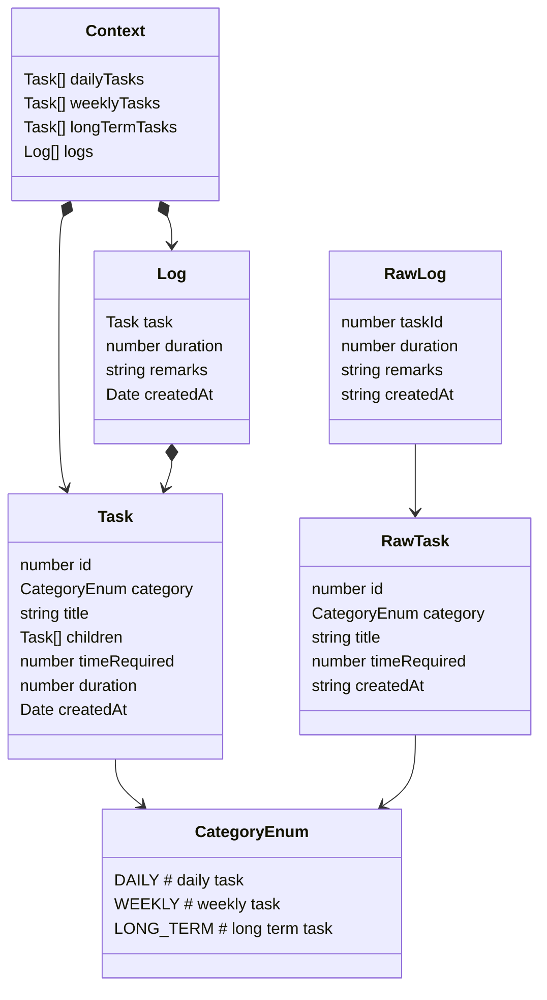

# Time Scheduler Electron


## Overview


```mermaid
classDiagram

Context *--> Task
Context *--> Log
Context : Task[]  dailyTasks
Context : Task[]  weeklyTasks
Context : Task[]  longTermTasks
Context : Log[]   logs


Task --> CategoryEnum
Task : number       id
Task : CategoryEnum category
Task : string       title
Task : Task[]       children
Task : number       timeRequired
Task : number       duration
Task : Date         createdAt


CategoryEnum : DAILY      # daily task
CategoryEnum : WEEKLY     # weekly task
CategoryEnum : LONG_TERM  # long term task


Log *--> Task
Log : Task    task
Log : number  duration
Log : string  remarks
Log : Date    createdAt


RawTask --> CategoryEnum
RawTask : number        id
RawTask : CategoryEnum  category
RawTask : string        title
RawTask : number        timeRequired
RawTask : string        createdAt

RawLog --> RawTask
RawLog : number taskId
RawLog : number duration
RawLog : string  remarks
RawLog : string createdAt
```


## Quick start

```sh
npm install
npm run dev
```
